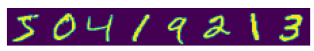

## HPC exercise training a neural network on the MNIST data-set.
- The exercise explores training a neural network using [the torch c++ api](https://pytorch.org/cppdocs/).



You will learn how to train a network to recognize handwritten digits. To do so we will use the mnist data-set.
The image above shows example images. The exercise assumes you are working on the systems at the Juelich Supercomputing Centre.
To solve this exercise look through the files in the `source` folder. `TODO`s mark parts of the code that require your attention.
Come back to this readme for additional hints.

- To get started on the JUWELS Booster load the modules
``` bash
Stages/2023 GCC/11.3.0  OpenMPI/4.1.4 CUDA/11.7 CMake PyTorch
```

- Use `mkdir build` to create your build directory. Change directory into your build folder and compile by running:
```bash
cmake -DCUDA_CUDA_LIB=/usr/lib64/libcuda.so -DCMAKE_PREFIX_PATH=`python -c 'import torch;print(torch.utils.cmake_prefix_path)'` ..
cmake --build . --config Release
```

- Navigate to `source/net.h` implement the constructor for the `Net` struct.
The `Net` should implement a fully connected network

$$
    y = \ln(\sigma (W_3f_r(W_2 f_r(W_1 x + b_1)  + b_2) + b_3))
$$

with $W_1 \in \mathbb{R}^{h_1, n}, W_2 \in \mathbb{R}^{h_2, h_1}, W_3 \in \mathbb{R}^{m, h_2}$
and $b_1 \in \mathbb{R}^{h_1}, b_2 \in \mathbb{R}^{h_2}, b_3 \in \mathbb{R}^{m}$, where
$n$ denotes the input dimension $h_1$ the number of hidden neurons in the first layer $h_2$ the number of neurons in the second layer, and $m$ the number of output neurons.
Finally $\sigma$ denotes the [softmax function](https://en.wikipedia.org/wiki/Softmax_function) and $\ln$ the natural logarithm.
Use `register_module` to add `Linear` layers to the network. Linear layers that implement $Wx +b$ are provided by `torch::nn:Linear`.
Move on to implement the forward pass. Follow the equation above, use `torch::relu` and
`torch::log_softmax`. What happens if you choose `torch::sigmoid` instead of the ReLU?

- Before training your network network implement the `acc` function in `source/train_net.cpp`. It should find the ratio of
correctly identified digits, by comparing the `argmax` of the network output and the annotations.

- Torch devices are defined i.e. by `torch::Device device = torch::kCPU;` move to GPUs by choosing `torch::kCUDA;` if cuda-GPUs are available. 

- Finally iterate over the test data set and compute the test accuracy.

-  Train and test your network by executing:
```bash
./train_net
```

- When your network has converged, you should measure more than 90% accuracy.

